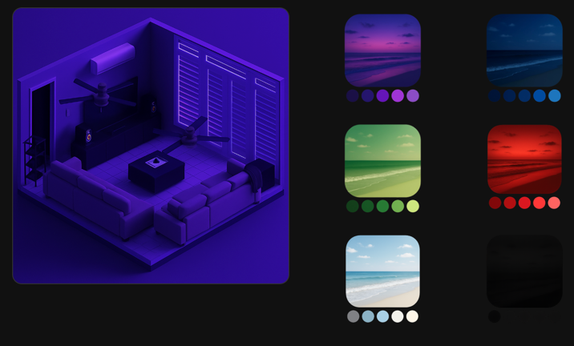

# Home Assistant Light Selector UI

A complete image-based light selection interface for Home Assistant dashboards. This project allows users to control light colors via picture buttons and see that reflected in a dynamic room image. It uses `card-mod`, `button-card`, and a template sensor to create a visual and responsive experience ideal for tablets, kiosks, and polished dashboards.

---



## Overview

This tool enables:

- Visual light selection using image buttons
- Automatic detection of current light color
- Smooth transitions between background images based on light color
- Fully customizable assets and structure

All images are stored in `/www/images/`, but accessed in Lovelace as `/local/images/...`.

---

## Features

| Feature                | Description                                                               |
| ---------------------- | ------------------------------------------------------------------------- |
| Visual light selection | Users select colors by tapping themed image buttons                       |
| Dynamic room feedback  | A picture-elements card updates to match the current light color          |
| Color detection sensor | A helper sensor uses RGB comparison to label active light color           |
| Custom assets          | Easily swappable PNG files for room states and selector buttons           |
| Smooth transitions     | Transitions between images via `card-mod` using CSS variables and opacity |

---
## Known Limitations
This system currently only evaluates a single light's rgb_color to determine the overall color theme of the room. This works well for coordinated themes (e.g., all lights blue or all red), but can break down when multiple lights are set to significantly different colors.

In its current form, the design assumes one dominant color defines the mood. Future improvements could involve averaging multiple light values or building a hierarchy of color priority across lights, but that hasn't been implemented yet.

This limitation is important to understand when building light scenes — if your room regularly uses diverse colors simultaneously, you'll need to adapt the detection logic or use custom overrides.

Rename `light.tv_light_1` to whichever light you plan to use as an anchor

---

##  Image and Selector Generation (via ChatGPT)
You will need to generate all images used.
This example may be used as a quick start, but to personalize it to your room, use a clean photo of your room
and follow the instructions below.

All visual assets can be generated using ChatGPT-4o, including both the isometric room renders and the color selector icons. Here’s the proven workflow:

### Generate Room Backgrounds

1. Take a clean photo of your actual room
2. Ask ChatGPT-4o:
   > "Generate an isometric 3-D model of this room and keep the composition as accurate as possible"
3. When satisfied with the style, **re-upload the result** to GPT and say:
   > "Take this exact image. Change nothing, except make the lighting blue"
4. Repeat with different lighting instructions for all your color scenes. Make sure to reupload the base image with each prompt


## How It Works

### 1. **Color Selector Buttons**

Defined in `button-stacks.yaml`, these use `custom:button-card` with image styling and script triggering.

```yaml
- type: horizontal-stack
  cards:
    - type: custom:button-card
      entity: light.bcl_local
      entity_picture: /local/images/color_selectors/blue_lights.png
      show_entity_picture: true
      tap_action:
        action: call-service
        service: script.lights_blue
```

- Each row uses a `horizontal-stack`
- Each button uses an image from `color_selectors/`
- Each tap calls a predefined `script.*` (you define the script)
- You can use a script, or any other method. It simply needs to change the color of the lights
- Styling removes padding/borders and sizes the image for clean UI

> This structure can be freely edited. The YAML provided includes two buttons per row to match the original layout.

---

### 2. **Room Image Display**

Defined in `picture_card.yaml`, this uses `custom:mod-card` to wrap a `picture-elements` card and change opacity per image dynamically.

```yaml
- type: custom:mod-card
  card_mod:
    style: |
      :host {
        
        --blue-opacity: {{ '1' if state == 'blue' else '0' }};
        ...
      }
  card:
    type: picture-elements
    image: /local/images/blank.png
    elements:
      - type: image
        image: /local/images/rooms/living_room_blue.png
        style:
          opacity: var(--blue-opacity)
          transition: opacity 0.5s ease-in-out
```

- A blank base image is used as a canvas
- Each color state (e.g., blue, green, red, off) has its own `image:`
- Opacity and z-index are controlled by `card-mod` using template sensor state
- Transition property ensures smooth fading between states

---

### 3. **Color Detection Sensor**

This template sensor is created via **Helpers > Template Sensor** in the UI or via YAML (file: `light_sensor.yaml`).

It reads the RGB color of a light and uses Euclidean distance to return a string label for the closest named color.


#### Named colors include:

- red, green, blue, purple, pink, lime, orange, cyan, skyblue, navy, darkblue, indigo, magenta, midnightblue, white, black, etc.

---

## Setup Instructions

1. **Install requirements via HACS:**

    - `card-mod`
    - `button-card`

2. **Place your images:**

    - Room states: `/config/www/images/rooms/`
    - Selector buttons: `/config/www/images/color_selectors/`

3. **Create the light color sensor:**

    - Go to *Settings > Devices & Services > Helpers > + Create Template Sensor*
    - Paste the logic from `light_sensor.yaml`

4. **Define your scripts:**

    - Create a `script.lights_red`, `script.lights_blue`, etc.
    - Each script should change the RGB color of the light

5. **Add dashboard YAML:**

    - Add `button-stacks.yaml` and `picture_card.yaml` via Manual Cards or `ui-lovelace.yaml`

---

## Extending It

- Add more colors to the named color map
- Add brightness or hue detection to the template sensor
- Create themed UIs for different rooms
- Add toggle buttons or brightness sliders beside the color selectors
- Use a `blank.png` that matches your dashboard theme for best visual blending

---

## What This Is NOT

- This is **not** a theme-switcher or a complete lighting automation
- It doesn’t use `input_select`, `light profiles`, or `scene` objects — though you can adapt to them
- It doesn’t support multi-light group awareness out-of-the-box

---

## Extras
`test-tool.html` is included for testing purposes

It's difficult to stare at RGB codes and visualize color.

This is a color picker tool that also shows the output of the logic from the light sensor

This can be used to quickly plug in new color codes and track the behavior of the tool

---

## Credits & Notes

- All YAML styling uses clean, no-padding, no-border buttons with rounded image thumbnails
- `card-mod` enables per-state CSS variable injection
- `picture-elements` layering allows image blending without heavy state management

This project is ideal for clean, image-centric dashboards where users want an ambient and intuitive control surface.

